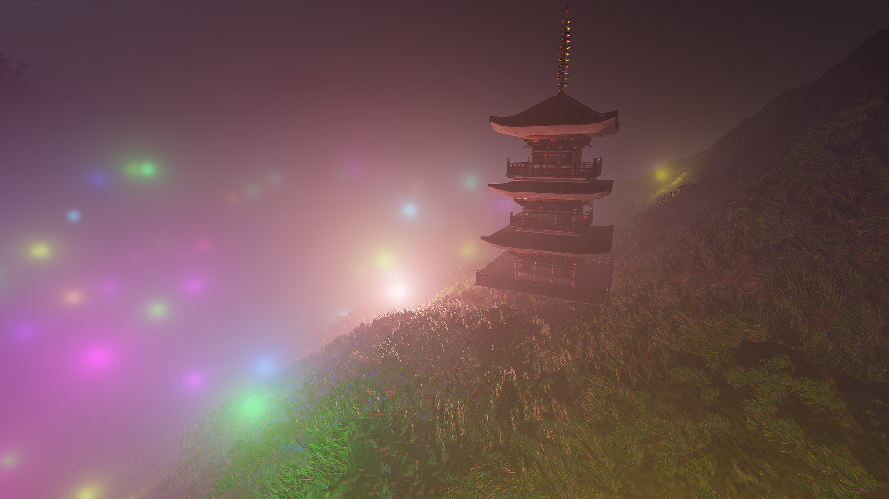

 
    FIXME: Replace width=100% with something else
    so that browser zoom can work properly.


Hello! My name is Julius Häger and I'm a Swedish graphics programmer.

I'm the current maintainer of [OpenTK](https://github.com/opentk/opentk), a platform abstraction layer and OpenGL bindings for C#, and this is my work.

# [OpenTK](http://github.com/opentk/opentk) maintainer

OpenTK provides OpenGL bindings and window creation and management for C#, and has over 5.8 million downloads on [Nuget](https://www.nuget.org/packages/OpenTK/).

I've been maintainer for OpenTK since November 2020. 
During that time we've worked hard on our new OpenGL bindings generator and platform abstraction layer targeting Win32, Linux, and macos.

# Master's thesis

I'm currently working on my master's thesis in spectral upsamling with fluorescense. Here is a little sneak-peek of my work.

# [Two New Methods for Real-Time Ptex](http://www.diva-portal.org/smash/get/diva2:1701157/FULLTEXT01.pdf)

In 2022 me and Hugo Dettner presented two new methods for efficiently rendering and filtering ptex on the GPU in real-time as part of our Batchelor's thesis. One of our presented methods outperformed previous work while having quality matching previous state of the art.

# [Volumetric fog and clustered forward rendering](https://github.com/NogginBops/DD2470_Clustered_Volume_Renderer)

Volumetric fog implemented using frustum aligned volume texture and clustered forward rendering implemented for my project in a course about advanced graphics.

# Area lights using Linearly Transformed Cosines

I implemented this as my project for the course DH2323. I had previously seen the paper for [Linearly Transformed Cosines](https://eheitzresearch.wordpress.com/415-2/) and had been interested in implementing it and this was a perfect oppurtunity to do so.

# Real-time GPU path tracer

I made a small real-time GPU path tracer for the course DH2323 at KTH. 
It's written in C# using OpenTK, and has BVH acceleration.

# Game engine using OpenTK/C#

A "from scratch" game engine written with OpenTK. It features a PBR render pipeline, cascaded shadow maps, frustum culling, and integrated physics using [BepuPhysics2](https://github.com/bepu/bepuphysics2). The engine also contains nice to have features such as live shader reloading.

<video src="https://user-images.githubusercontent.com/3778357/236922766-f7f19a92-adf8-4a11-8964-0e06f8dcf793.mp4" controls="controls" style="max-width: 100%;"></video>

Video showing transform gizmo and undo functionality.

<video src="https://user-images.githubusercontent.com/3778357/236922495-14b9d709-3af1-483a-9f68-4f89cb2e93fc.mp4" controls="controls" style="max-width: 100%;"></video>

Video showing live shader reloading.

<video src="https://user-images.githubusercontent.com/3778357/236922373-4e67a1ce-a7af-4d61-8172-3daa2b880e4d.mp4" controls="controls" style="max-width: 100%;"></video>

Video showing frustum culling.

# [Metro vision](https://marcuskaraker.itch.io/metrovision)

Metro vision was made during the 2020 GMTK Game Jam where I and a team of 8 other people made a innovative puzzler where your line of sight determines what controls/actions are available at your displosal.

# [Candela](https://swedishpancaces.itch.io/candela)

A small charming game about a candle finding it's place. Make in 48 hours for the 2017 GMTK Game Jam, in a team of 3 people.

# [Block buster](https://globalgamejam.org/2019/games/block-buster)

Block Buster was created in 48h during the 2019 Global Game Jam in a team of 9 people.

<iframe width="560" height="315" src="https://www.youtube.com/embed/yMX827OTp2c" title="YouTube video player" frameborder="0" allow="accelerometer; autoplay; clipboard-write; encrypted-media; gyroscope; picture-in-picture; web-share" allowfullscreen></iframe>

# Gallery

A gallery of random screenshots from my graphics coding adventures.

PBR sphere.

Multiple lights and editor gizmos.

Particle effect.

Mandelbrot set visualization.

Particle system with shadowed particles, creating an illusion of volumetric shadow.

Debugging visualizations created when implementing Cascaded Shadow Maps.

<video src="https://user-images.githubusercontent.com/3778357/236923069-2151ee3b-207a-486c-8099-ca39c7c256bf.webm" controls="controls"></video>

<video src="https://user-images.githubusercontent.com/3778357/236923033-33bd9357-6faf-4f4a-a4c5-4c72ab3036af.mp4" controls="controls" style="max-width: 100%;"></video>

An Immediate Mode GUI I made.
